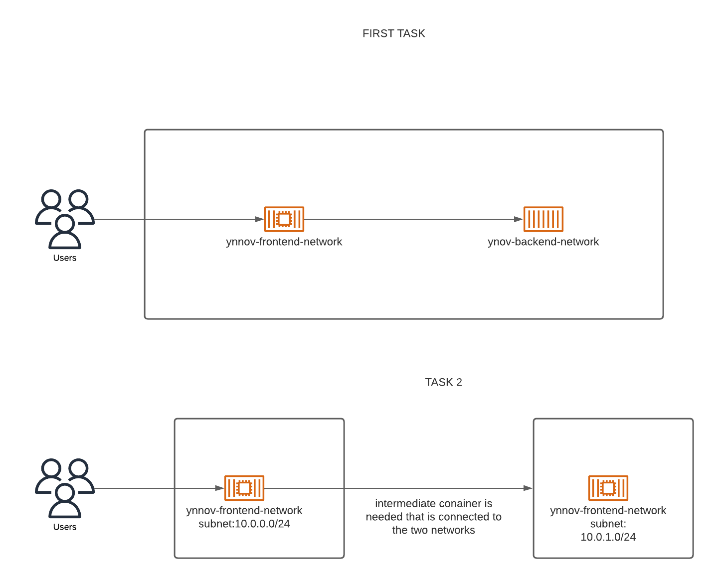

# Projet de Réseautage Docker pour Prestashop

Ce README décrit le déploiement d'une application e-commerce Prestashop à l'aide de Docker, en se concentrant sur les aspects de réseautage entre les conteneurs de l'application.

## Table des Matières
1. [Introduction](#introduction)
2. [Architecture](#architecture)
3. [Aperçu des Tâches](#aperçu-des-tâches)
   - [Tâche 1 : Déploiement dans un Réseau](###tâche-1-déploiement-dans-un-réseau)
   - [Tâche 2 : Création de Réseaux Avancés](###tâche-2-création-de-réseaux-avancés)
4. [Exigences de Soumission](#exigences-de-soumission)
5. [Membres de l'Équipe](#membres-de-léquipe)

## Introduction

L'objectif de ce projet est de déployer une application e-commerce Prestashop en utilisant des conteneurs Docker. L'application se compose d'un site web frontend et d'une base de données pour stocker les données persistantes.

## Architecture

Le diagramme ci-dessus représente l'architecture réseau pour le déploiement de l'application Prestashop.

## Aperçu des Tâches

### Tâche 1 : Déploiement dans un Réseau

Déployer l'application de manière à ce que le conteneur du site web et le conteneur de la base de données puissent communiquer en utilisant leurs noms.

docker run -d --name mariadb_nabil_rayan --network mon_reseau_nabil_rayan -e MYSQL_ROOT_PASSWORD=0000 -e MYSQL_DATABASE=prestashop_db -e MYSQL_USER=prestashop_user -e MYSQL_PASSWORD=0000 -v mariadb_data_nabil_rayan:/var/lib/mysql mariadb

docker run -d --name prestashop_nabil_rayan --network mon_reseau_nabil_rayan -e DB_SERVER=mariadb_nabil_rayan -e DB_NAME=prestashop_db -e DB_USER=prestashop_user -e DB_PASSWD=0000 -p 8080:80 -v prestashop_data_nabil_rayan:/var/www/html prestashop/prestashop

### Tâche 2 : Création de Réseaux Avancés

- Créer deux réseaux avec les CIDR spécifiés dans les schémas : `ynov-frontend-network` et `ynov-backend-network`.
  docker network create --subnet=10.0.0.0/24  ynov-frontend-network
  docker network create --subnet=10.0.1.0/24 ynov-background-network
- Mettre en place un conteneur intermédiaire, tel qu'un `gateway` ou `router`, et le connecter aux deux réseaux.
   docker run -d -name nginx-router -network ynov-frontend-network nginx
- Configurer la table de routage dans le `gateway` avec la commande `ip route add <FROM_CIDR_REPLACE_ME> via <GATEWAY_IP_FROM_EACH_NETWORK_SIDE>` pour les deux réseaux.
  docker exec nginx-router ip route add 10.0.0.0/24 via 10.0.0.1
  docker exec nginx-router ip route add 10.0.1.0/24 via 10.0.1.1

## Membres de l'Équipe

- **Membre 1** : Nabil Hatri
- **Membre 2** : Rayan Khalfoun

